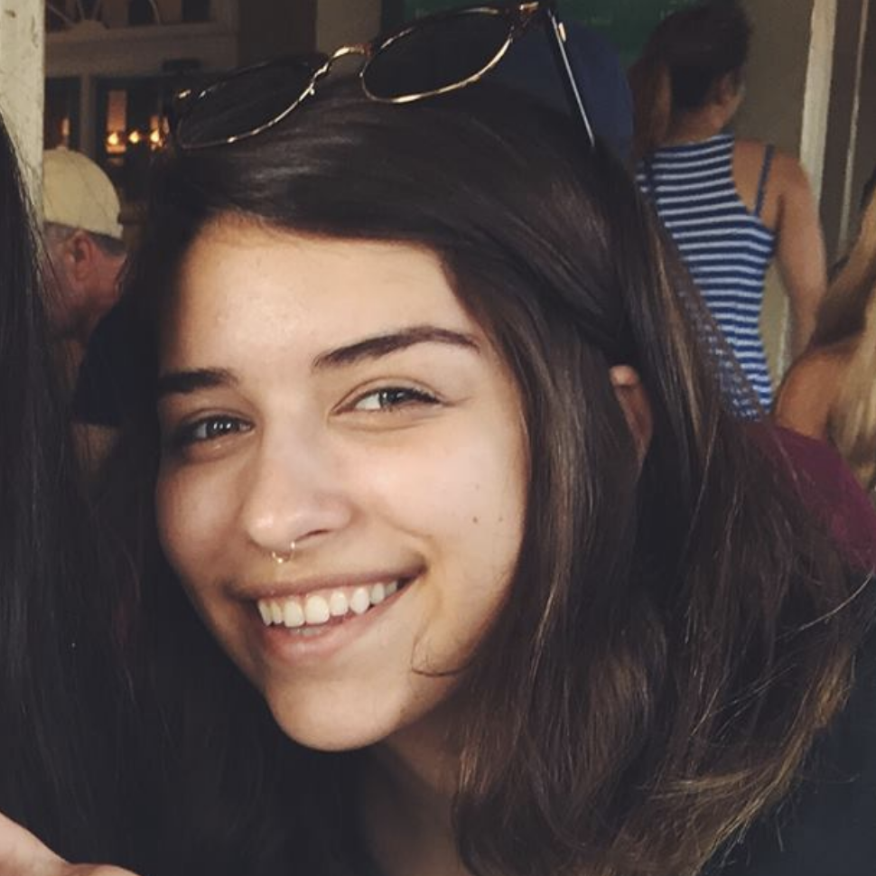

# Runescrape.lol
### Meet Me in Lumbridge

---

# Meet the Team
@fa[angle-down fa-3x]

+++

### Claire Bingham

### Duties:
###### Front end, Design, Data Collection, Gitpitch

+++

### Steven Diaz

### Duties:
###### Backend, API, Deployment

+++

### Liam Decoste

### Duties:
###### Front end, Design, Deployment

+++

### Luke Wright

### Duties:
###### Backend, API

+++

### Ben Randall

### Duties:
###### Front end, Mocha testing, Data Collection, Gitpitch

+++

### Dylan Ramage

### Duties: 
###### Front end, Selenium testing

---

# Demonstration
[Runescrape](http://www.runescrape.lol/)

---

# Self Critique

---

### What did we do well?
@fa[angle-down fa-2x]
+++
* Communication
  * Divying up roles and communicating effectively allowed us to smoothly transition from phase to phase.
  * Prevented us from stepping on each other's toes
+++
* Focused concept
  * Our project concept was very narrowed down and specific, eliminating confusion for a customer and increasing ease of use 
+++
* Version control, issue tracking, Github organization
  * Maintained efficient, consistent issue tracking throughout the project
  * Peer reviewed all pull requests
  * Project boards updated constantly so everyone could be on the same page
+++
* As-we-go refactoring
  * Refactoring throughout each phase reduced the amount of refactoring we had to do at the end

---

### What did we learn?
@fa[@fa[angle-down fa-2x]
+++
* Debugging
  * Despite having knowledge of the individual tools required for the project, we had a lot of learning to do for debugging
  * i.e. Using react dev tools, debugging in our deployment environment/docker, etc.
+++
* Plan ahead
  * Figuring out a project structure ahead of time would have been very beneficial and saved us time refactoring over and over again
  * Having a better idea of what our UI could realistically look like 
+++
* AWS instances
  * Upgrading our AWS EC2 instance was unexpected 
+++
* Leveraging 6 people
  * Six people on one project can be quite a lot, so we learned how to efficiently leverage everyone's skills
---

### What can we do better?
@fa[@fa[angle-down fa-2x]
+++
* Loading times
  * Some react components/various pages do still have a noticeable loading time
  * Adjusted with caching, but some initial load times still noticeable +++
+++
* Increase filter & search capabilities
  * i.e. allow filtering by model type on Search results
  * Make search even more "google-like"
+++
* Pair programming & meeting up 
  * Especially in person, to easily sync up on what everyone is expected to work on 
  * Face to face time can be extremely valuable in a group this large
+++
* Time management
  * We found we're all pretty good at procrastinating
+++
* UI Improvements
  * Some of our UI still looks a bit rudimentary, definitely room for improvement

---

### What puzzles us?
@fa[angle-down fa-2x]
+++
* Designing a site with so many interconnected data points
  * Sometimes design ideas get lost in translation from conception to the screen
+++
* Mocha testing
  * We found quite a bit of difficulty writing mocha tests 
  * Sometimes they played nicely with our react components, other times not so much
+++
* Data scraping
  * Sometimes creating links between data instances gathered from an API can be a challenge

---

# Parkd.us Critique

---

### What did they do well?
@fa[angle-down fa-2x]
+++

* Thing #1
+++
* Thing #2
+++
* Thing #3
+++
* Thing #4

---

### What did we learn from them?
@fa[angle-down fa-2x]
+++
* Thing #1
+++
* Thing #2
+++
* Thing #3
+++
* Thing #4

---

### What can they do better?
@fa[angle-down fa-2x]
+++
* Thing #1
+++
* Thing #2
+++
* Thing #3
+++
* Thing #4

---

### What puzzles us about their site?
@fa[angle-down fa-2x]
+++
* Thing #1
+++
* Thing #2
+++
* Thing #3
+++
* Thing #4
+++

---

# D3 Visualization

